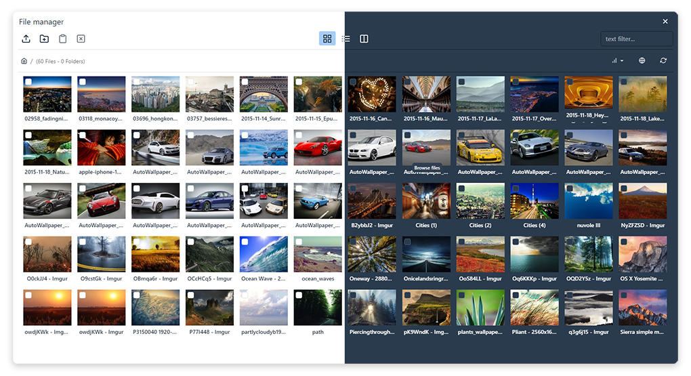

# Responsive FileManager Bootstrap 5 for TinyMCE



**PRODUCTION VERSION DOWNLOAD:** [GitHub Release](https://github.com/Turbo-CMS/ResponsiveFilemanager-Bootstrap-5/releases)

Released under Creative Commons Attribution-NonCommercial 3.0 Unported License.

### Server Requirements

- PHP 7.1 or above strongly recommended
- [Apache 2.2 or 2.4](https://httpd.apache.org/)

### Use as TinyMCE 7 File Manager

1. **Copy** the folder `tinymce/plugins/responsivefilemanager` to `tinymce/plugins/` on your server.

   > **Note:** Remember that `responsivefilemanager` is **not** the `filemanager` folder but an additional plugin.

2. **Configure TinyMCE:**  
   Make sure your TinyMCE settings include `responsivefilemanager` in the plugins list:
   - Add `responsivefilemanager` to the plugins list.

```js
   tinymce.init({
      selector: 'textarea',
      height: 500,
      plugins: [
         'advlist', 'autolink', 'lists', 'link', 'image', 'charmap', 'preview',
         'anchor', 'searchreplace', 'visualblocks', 'code', 'fullscreen',
         'insertdatetime', 'media', 'table', 'help', 'wordcount', 'responsivefilemanager'
      ],
      toolbar: 'undo redo | blocks | ' +
      'bold italic backcolor | alignleft aligncenter ' +
      'alignright alignjustify | bullist numlist outdent indent | ' +
      'removeformat | media image | help',
      content_style: 'body { font-family:Helvetica,Arial,sans-serif; font-size:16px }',
      external_filemanager_path:"/filemanager/",
      filemanager_title:"Responsive Filemanager",
      external_plugins: { "filemanager" : "/filemanager/plugin.min.js" }
      });
   ```

### TinyMCE Configuration

You can pass these variables in the TinyMCE initialization:

- **filemanager_title:** The title of the file manager window. Default value is `"Responsive filemanager"`.
- **filemanager_sort_by:** The element to sort by. Possible values: `name`, `size`, `extension`, `date`. Default value is `""`.
- **filemanager_descending:** Whether to sort in descending order. Possible values: `1` (descending) or `0` (ascending). Default value is `"0"`.

> [!WARNING]  
> If you want the full path URL in TinyMCE paths, you can set `relative_urls: false` in your TinyMCE initialization.

- **external_filemanager_path** and **external_plugins** path must be absolute from the root and must point to the filemanager folder, not the responsivefilemanager plugin folder.

---

Change the path in your TinyMCE init function for `external_filemanager_path` and `external_plugins`. The path must be an absolute path from the base URL of your site and must start with `/`. For example, if the filemanager folder is located at `www.site.com/filemanager/`, the path should look like that.

> [!WARNING]  
> If you are updating from an older version (from 1 to 7), substitute your TinyMCE with the new version, or download and copy only the `image`, `media`, and `link` folders from the original files into your TinyMCE plugin folder.

### Dark Mode

```js
   tinymce.init({
      selector: 'textarea',
      skin: "oxide-dark",
      content_css: "dark",
      height: 500,
      plugins: [
         'advlist', 'autolink', 'lists', 'link', 'image', 'charmap', 'preview',
         'anchor', 'searchreplace', 'visualblocks', 'code', 'fullscreen',
         'insertdatetime', 'media', 'table', 'help', 'wordcount', 'responsivefilemanager'
      ],
      toolbar: 'undo redo | blocks | ' +
      'bold italic backcolor | alignleft aligncenter ' +
      'alignright alignjustify | bullist numlist outdent indent | ' +
      'removeformat | media image | help',
      content_style: 'body { font-family:Helvetica,Arial,sans-serif; font-size:16px }',
      external_filemanager_path:"/filemanager/",
      filemanager_title:"Responsive Filemanager",
      external_plugins: { "filemanager" : "/filemanager/plugin.min.js" }
      });
   ```